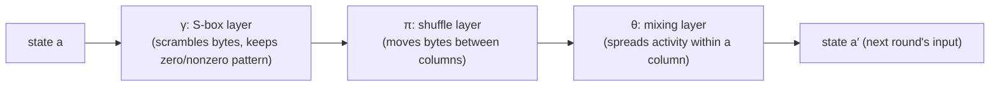
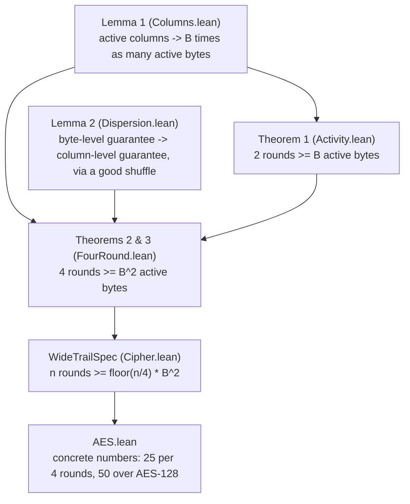

# WideTrail

*a parametric Lean 4 formalization of the wide trail propagation theorems, producing kernel-checked active-S-box bounds for AES-like designs*

Based on Daemen and Rijmen's [The Wide Trail Design Strategy](https://www.researchgate.net/publication/225704500_The_Wide_Trail_Design_Strategy).

---

## What's in each file

The files import each other in this order, each one building on the last.

### [`WideTrail.lean`](WideTrail.lean)
The entry point. It just imports every file below, so the whole library is one `import WideTrail` away.

### [`WideTrail/Activity.lean`](WideTrail/Activity.lean)
The foundation. Defines what it means for a position in the cipher's state to be "active" (its difference is nonzero), counts how many positions are active (the *weight*), and proves the basic two-round bound: across any two rounds, the number of active positions is at least the branch number of the mixing layer.

### [`WideTrail/Columns.lean`](WideTrail/Columns.lean)
Groups the state into columns, the way AES groups bytes into 4-byte columns, and proves that if the mixing layer guarantees a minimum spread within each column, that spread adds up: any set of active columns forces that many times more active bytes overall (**Lemma 1**).

### [`WideTrail/Dispersion.lean`](WideTrail/Dispersion.lean)
Models the shuffle step (like ShiftRows) that scrambles which column each byte belongs to between rounds. Proves that if this shuffle is "diffusion optimal", meaning no two bytes from the same column ever end up sharing a column again, then a column-level guarantee can be upgraded into a stronger bundle-level one (**Lemma 2**).

### [`WideTrail/FourRound.lean`](WideTrail/FourRound.lean)
Combines Lemma 1 and Lemma 2 into the paper's two headline theorems: any four consecutive rounds of a wide-trail cipher force at least `B²` active S-boxes, where `B` is the branch number of the mixing layer. It's proved for both of the paper's cipher shapes, to show they agree.

### [`WideTrail/Cipher.lean`](WideTrail/Cipher.lean)
Packages a whole cipher design (its column layout, S-box, shuffle, mixing layer, and the proof obligations they must satisfy) into a single structure, `WideTrailSpec`. Also extends the four-round theorem to any number of rounds by chaining four-round blocks together.

### [`WideTrail/AES.lean`](WideTrail/AES.lean)
Plugs the real AES shape into `WideTrailSpec`: a 4×4 grid, ShiftRows as the shuffle, and a MixColumns with branch number 5 (a property of AES that's taken as a given here, rather than re-derived from finite-field arithmetic). Out comes the actual numbers: at least 25 active S-boxes over any four rounds, and 50 over all ten rounds of AES-128.

### [`WideTrail/Verification.lean`](WideTrail/Verification.lean)
A sanity-check file, not a source of new results. It builds a toy cipher to show the theorems' assumptions can all hold at once (so nothing here is vacuously true), builds a second toy cipher that is missing only the "diffusion optimal" shuffle property to show the bound genuinely breaks without it, and re-derives the AES bound through the alternate proof route to confirm both routes agree.

---

## How this works as a program, and why it's useful

At its core, this project turns a cipher's design into a small set of numbers, and a machine-checked proof that those numbers can't be beaten.

### The shape of a round

Every round of a wide-trail cipher is the same three steps, one after another:

Only the mixing layer `θ` can actually reduce how "spread out" a difference is; the S-box layer never merges positions together, and the shuffle only relocates them. That's the entire reason the argument works: count what `θ` guarantees, and you've counted what the whole round guarantees.

### From one round to a certified bound

The files build the proof up in layers, each one feeding the next:

`Verification.lean` sits off to the side of this chain: it doesn't add a new theorem, it stress-tests the ones above by trying to break them with small hand-built examples.

### Why this is useful

Normally, showing a cipher resists differential and linear cryptanalysis means hand-checking (or exhaustively searching) huge numbers of specific attack patterns, one cipher at a time. This project instead proves a bound that holds for an entire *family* of cipher designs at once, AES included, as long as the design follows the wide-trail shape: an S-box layer, a well-mixing layer, and a shuffle that spreads columns well.

Two things make that bound trustworthy:

- **It's kernel-checked.** Lean's kernel is a small, independently trusted piece of software. If the project compiles, every theorem in it is guaranteed correct by that kernel, not by a human re-reading the proof or a test suite that might miss a case.
- **It's parametric.** The branch number, the state size, and the mixing layer are all just parameters. Swap in a different design with the same shape, and the same machinery hands you a new certified bound for free, instead of redoing the argument by hand.

The payoff of the bound itself: each active S-box cuts down an attacker's odds of guessing right, so a guaranteed minimum count of active S-boxes over every four rounds puts a hard ceiling on how good a differential or linear attack can ever get against the full cipher, no matter how many rounds are chained together.

---

## The basic principles, dumbed down

Take two plaintexts P and P' (differing in a chosen way) and cipher E_k
let `a'= P ⊕ P' && b' = E(P) ⊕ E(P')`
when E behaves like a random permutation on 128bit blocks for fixed a'
b' would be spread ≈uniformally over 2^128 possibilities and that means any b showing up has 2^-128 probaility
We define the difference propagation probability (for n-bit vectors a and (a'-a))as:
`P_h(a', b') = (2^-n)∑∆(b' + h(a + a') + h(a))`
∆(x)=0 forall x except ∆(0) = 1 so you can see direct implication of the spread of probability over bits.

so when i say dumbed down i ll also explain another thing here: 
### why differences specifically?

Round key enters by XOR, a and a* (a'-a) both get key 'k' XORed into them:
`(a⊕ k) ⊕ (a* ⊕ k) = a ⊕ a*` --> the key cancels
difference passes through key addition completely unchanged for every key. 
The same happens at any linear layer λ because linear means `λ(a) ⊕ λ(a*) = λ(a ⊕ a*)`.. the difference passes and key never enters
So in a key alternating cipher where there are 3 components in a round, 2 of them handle differences in a way that is exact and key independent

**The only place a difference behaves probabilistically at all is the S box layer** 

### the attack and the design

we can see the shape of the attack minimalised as: 

suppose you find a pair (a', b') where prob is 2^-30, which is 2^98 times more likely than it should be, the lever we have here is:
1. collect ~2^30 plaintext pairs with difference `a'`
2. Guess the final round key `k_r`
3. Decrypt the last round of both ciphertexts under that guess. 
4. Check whether the difference at round r-1 matches what the above high probability pattern says

so *attack* basically is among randomly showing up (scrambling guesses) predictions the right guess makes it show up at 2^30 and the correct k_r stands out from a counter array, and we peel off the last round key and repeat inwards.
Taking this further down the explain easy road because neither a beginner (or chatgpt) can wrap itself around the fundamentals:

two inputs:
`P  = 01010101...`
`P* = 01011101...`
almost same, and call the difference `a' = 00001000...`
encrypt both: E(P) and E(P*) and diff these outputs
Now think a perfectly random cipher:
knowing that inputs differ by a' will help with learning nothing about how outputs differ, it could be any of 2^128 possible 128 bit patterns `Pr[a' -> b'] ~2^-128`

But the weakness here:
Suppose by a chance you discover that when giving the cipher two inputs with diff `a'` the output differences are `b'` quiet often
like imagine `Pr[a'-> b'] ~2^-30`
That gives a statistical wrap of the cipher's internal structure!

*How will this help find the key?*

in an AES lik encryption, the P goes through suppose r rounds
P-> round1 ->.... round r-> ciphertext
here round r is the key we re trying to find
but you cant see the diff before the final round

1. decrypt final round using the guessed key with ciphertext pair
2. Xor together with guessed round r-1 values

does the difference look like as predicted?
so if the key guess is wrong its garbade random internal values...

Key guess          Number of matches

Guess A                  0
Guess B                  1
Guess C                  0
Guess D                  2
Guess E                  947  ← whoaa
Guess F                  1
Guess G                  0

*differential cryptanalysis is basically finding a weird cause-effect*
*relation in how differences are propagating in a cipher.* 

the key detector is nothing but a statistical bias.

### Inside S-box

think of a small lookup table like `S : {0, 1}^8 -> {0, 1}^8`. its invertible, non linear meaning it doesnt commute with XOR..

take two inputs (x and a') and pass through the S-box
x          ──> S(x)
x ⊕ a'     ──> S(x ⊕ a')
see the diff `S(x) ⊕ S(x ⊕ a')`

suppose
a' = 00000001
x  = 00000000

S(x)       = something
S(x ⊕ a') = something else

output difference = S(x) ⊕ S(x ⊕ a')

at the end we might get something like:
Input difference = a'

a DDT (difference ditribution table):

Output difference       Number of times

00000000                     0
00110110                     2
10011001                     4  <- happens 4 times
01010111                     2
...
..
